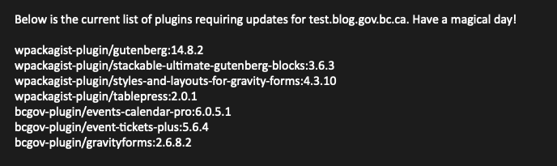

# Check for WordPress Plugin Updates

## About
WordPress Plugin Update Checker (wpp-check), runs the standard `wp plugin list --update=available` command as well as some custom searches to grab those hard to find updates.

## Prerequisite

Googles' [Go language](https://go.dev) installed locally to enable building executables from source code.

## Build

From the folder containing *main.go*, use the command that matches your environment:

Mac:

    go build -o {build_location}/wpp-check main.go

Linux:

    GOOS=linux GOARCH=amd64 go build -o {build_location}/wpp-check main.go

## Run

    ./{path_to_file}/wpp-check {server}.dmz {WordPress_path} {site}

Example:

    .~/Documents/git/premium/wpp-check coeurl.dmz /data/www-app/test_blog_gov_bc_ca/current/web/wp test.blog.gov.bc.ca

## License
Code is under Version 3.0 of the [GNU General Public License](https://github.com/nausicaan/checker/blob/main/LICENSE.md).